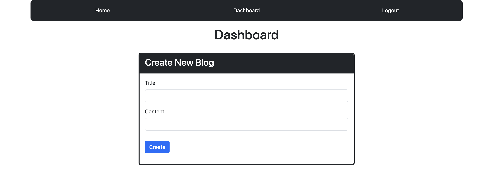

# MVC Tech Blog

## Repository

In this repository you will find the application code to an MVC tech blog app. The purpose of this application is for users to create accounts and have the ability to post tech related blogs and allow users to comment on tech blogs. This application makes GET, POST, PUT and DELETE requests. The dependencies for this application include bcrypt, connect-session-sequelize, dotenv, express, express-handlebars, express-session, mysql2, and sequelize. 

## Table of Contents

- [Contribute](#contribute)
- [Appearance](#appearance)
- [Usage](#usage)
- [Changes](#changes)
- [Features](#features)
- [License](#license)

## Appearance

Homepage:
    

Dashboard:
    

Create Blog:
    

Comment:
    

To view the deployed webpage click the following link: [Deployed Webpage](https://sleepy-woodland-43418-bc3903ee6c50.herokuapp.com/)

## Contribute

To view the repository of this application and contribute to this application click the following link:  [mvc-tech-blog](https://github.com/lmansilla92/mvc-tech-blog)

If you need help on how to clone a GitHub repository into your local repository, visit the following GitHub link: [Cloning a repository](https://docs.github.com/en/repositories/creating-and-managing-repositories/cloning-a-repository) 

## Usage

- To get started click the login link in the nav bar
- Signup by creating a username and password
- Once you're logged in, click the "New Blog" button in your dashboard to create a new blog
- In the homepage you can view all the blogs that have been created
- Click on a specific blog to leave a comment and view all of the blog's comments
- When you're finished, click the logout button or the session cookie will automatically expire and log you out after 5 minutes of inactivity

## Changes

I would like to make the following changes to this application:

- Work on the UI to enhance the design
- Add ability to edit and delete comments
- Toggle create comment form visiblity

## Features

Some of the features in this application include:

- Hashing passwords with bcrypt
- Use of handlebars as template engine
- Use of dotenv package to hide environment variables

## License

Link to [The MIT License (MIT)](https://github.com/lmansilla92/mvc-tech-blog/blob/main/LICENSE)